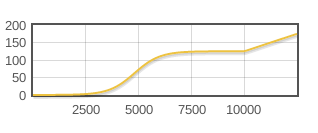

Architecture
============

Abstractly, the system takes a set of locations and populations, computes a decision metric for each location and connects selected communities to form networks.

`You are welcome to browse the source code <https://github.com/invisibleroads/networkplanner>`_.  

Decision Metrics
----------------

The decision metric is used to decide between different electricity technology options: off-grid photovoltaic panels coupled with a small diesel generator, mini-grid through a large diesel generator and grid through extension of medium voltage line.

.. toctree::
    :maxdepth: 1

    metric-mvMax5
    metric-mvMax4
    metric-mvMax3
    metric-mvMax2

Understanding mvMax
^^^^^^^^^^^^^^^^^^^

The mvMax decision metric is the maximum length of medium voltage line for which grid extension is cheaper than standalone options.  It is best understood by example.  

    Suppose the total cost of installing off-grid technology in a community is $50,000 and mini-grid technology is $40,000 including capital and recurring costs over a time horizon of ten years.  Then the cheapest standalone option costs $40,000.  
    
    Suppose also that the cost of preparing and maintaining a community for grid connection is $34,000 excluding the cost of the actual grid extension.  That means that we have a budget of $6,000 to extend the grid to the community because if the extension cost more than $6,000 it would be more cost-effective to go with a standalone option such as off-grid or mini-grid.  
    
    If grid extension costs $10 per meter, then we can convert the budget of $6,000 into 600 meters of extension.  That means that if the community is within 600 meters of an existing grid backbone, then it is cost-effective to connect the community to the grid compared to standalone options.  The mvMax decision metric for the community is 600 meters.

Computing mvMax
^^^^^^^^^^^^^^^

Computation of mvMax takes five stages:

1. :ref:`mvMax-projectPopulation`
2. :ref:`mvMax-projectDemand`

  - Project household demand.
  - Project productive demand for powering grain grinders and water pumps.  Productive demand is proportional to household count.
  - Project social infrastructure demand.
       
    - Project commercial facility count and demand.  A commercial facility can be a vendor stall in a marketplace.
    - Project educational facility count and demand.  An educational facility can be a primary school, secondary school or university.
    - Project health facility count and demand.  A health facility can be a hospital or clinic.
    - Project public lighting facility count and demand.  Public lighting includes street lamps and traffic lights.

3. :ref:`mvMax-sizeSystem`

  - Determine the needed photovoltaic panel capacity and diesel generator capacity for off-grid technology.
  - Determine the diesel generator capacity for mini-grid technology.
  - Determine the transformer capacity for grid technology.

4. :ref:`mvMax-estimateCost`
5. :ref:`mvMax-computeMetric`

.. _mvMax-projectPopulation:

Project population and household counts
"""""""""""""""""""""""""""""""""""""""

.. index::
    single: count; projected population

To project population in the first year, the system takes the community's initial population, determines whether it is rural or urban using a threshold and multiplies the population by the appropriate rural or urban growth rate.  For each subsequent year, the process repeats.  Thus it is possible for a community to start with a rural growth rate but end with an urban growth rate.

.. index::
    single: count; projected household

To project household count, the system takes the community's projected population count at the end of the time horizon and divides it by the appropriate rural or urban mean household size.

.. _mvMax-projectDemand:

Project electricity demand
""""""""""""""""""""""""""

To estimate each type of demand, the system multiplies the following factors:

A. :ref:`Demand multiplier relative to economic growth <mvMax-demand-economicMultiplier>`
B. :ref:`Demand scaling factor relative to projected population count <mvMax-demand-demographicScalingFactor>`
C. :ref:`Base demand in kWh/yr <mvMax-demand-baseUnitDemand>`
D. :ref:`Projected facility count <mvMax-demand-projectedFacilityCount>`

Let's explore each factor in more detail.
  
.. index::
    single: elasticity

.. _mvMax-demand-economicMultiplier:

A. To compute the demand multiplier, the system multiplies elasticity of demand by economic growth rate.  *Elasticity of demand* is a measure of how much demand will change in response to economic growth.  It is a way to capture the observation that as poor households get richer, the increase in their electricity demand tends to be proportionally larger than the increase in demand when rich households get richer.  A large value for elasticity means that economic growth will result in large increases in demand, while a small value for elasticity means that economic growth will have a negligible effect on demand.  Put mathematically, elasticity is the change in electricity demand per unit of economic growth.  Thus multiplying elasticity by economic growth rate gives electricity demand growth rate.

.. index::
    pair: curve; demand

.. _mvMax-demand-demographicScalingFactor:

B. To compute the demand scaling factor, the system fits a demand curve and interpolates the scaling factor using the projected population count.  You can derive the points used to fit the demand curve by tabulating population and demand data from a random sample of communities.  For example, the following table generates the household demand curve points 10000000 6; 4000000 5; 1000000 3; 500000 1.

=========== ========== ======================== =====================
Name        Population Average Household Demand Demand Scaling Factor
=========== ========== ======================== =====================
WWW Metro   10,000,000             1,200 kWh/yr       1,200 / 200 = 6
XXX City     4,000,000             1,000 kWh/yr       1,000 / 200 = 5
YYY Town     1,000,000               600 kWh/yr         600 / 200 = 3
ZZZ Village    500,000               200 kWh/yr         200 / 200 = 1
=========== ========== ======================== =====================

.. note::

    The assumption is that households in large cities consume more electricity than households in small towns.  A household in a city might have air conditioning and more lighting than a household in a village.

.. Add demand curve plot here

.. index::
    single: demand; base unit

.. _mvMax-demand-baseUnitDemand:

C. The base unit demand specifies the demand corresponding to the scaling factor of one.  In the example above, the base unit demand is 200 kWh/yr.

.. index::
    pair: curve; count
    single: count; projected facility

.. _mvMax-demand-projectedFacilityCount:

D. To compute the projected facility count, the system fits a count curve and interpolates the facility count using the projected population count.  You can derive the points used to fit the count curve by tabulating population and facility count data from a random sample of communities.  For example, the following table generates the commercial facility count curve points 10000000 10000; 4000000 5000; 1000000 500; 500000 50.

=========== ========== =================================
Name        Population Average Commercial Facility Count
=========== ========== =================================
WWW Metro   10,000,000                            10,000
XXX City     4,000,000                             5,000
YYY Town     1,000,000                               500
ZZZ Village    500,000                                50 
=========== ========== =================================

.. Add count curve plot here

.. _mvMax-sizeSystem:

Choose system sizes for each technology
"""""""""""""""""""""""""""""""""""""""

.. index::
    single: demand; peak

A. The projected peak demand in kilowatts determines the desired system capacity for electricity.  The system estimates peak demand by multiplying demand by a :ref:`conversion factor <mvmax3-demand-demandtopeakdemandconversionfactor>`.

  - For off-grid technology, the photovoltaic panel capacity is sized on projected peak household, peak educational, peak health and peak public lighting demand while the diesel generator capacity is sized on projected peak productive and peak commercial demand.
  - For mini-grid technology, the generator capacity is sized on projected peak demand for the community.
  - For grid technology, the transformer capacity is sized on projected peak demand for the community.

B. The desired system capacity translates into the available system capacities in a manner similar to converting money into a linear combination of fixed denominations like quarters, dimes and nickels.

C. The actual system capacity corresponds to the combined capacity of the chosen linear combination of system sizes and is guaranteed to be greater than or equal to the desired system capacity.

.. _mvMax-estimateCost:

Estimate capital and recurring costs for each technology
""""""""""""""""""""""""""""""""""""""""""""""""""""""""

The costs are broadly split between initial capital costs of purchasing and installing the technology and annual recurring costs of maintaining and replacing the technology, including material and human costs.  Interest rate is compounded annually for recurring costs and is used to compute the aggregate discounted cost for year zero.

.. _mvMax-computeMetric:

Compute decision metric
"""""""""""""""""""""""

The system takes the smaller of the off-grid and mini-grid discounted costs as the cheapest standalone option.  The difference between the cheapest standalone option and the internal cost of preparing and maintaining a community for grid connection is the budget available for external grid extension.  Finally, the system divides the budget available for grid extension by the cost of medium voltage line per meter to compute mvMax, or the maximum length of medium voltage line for which grid extension is cheaper than standalone options.

Overriding projections using community-specific data
^^^^^^^^^^^^^^^^^^^^^^^^^^^^^^^^^^^^^^^^^^^^^^^^^^^^

Note that community-specific data can override any of the intermediate variables in the model.  The model is useful because it can estimate demand and cost given only population and some country-wide assumptions, but community-specific data can provide more accurate localized projections when available.  It is a trade-off between gathering high-resolution data and getting estimates that are good enough.

Network Building Algorithms
---------------------------

The network building algorithms try to connect communities that are grid-compatible while optimizing for access or cost.

.. toctree::
    :maxdepth: 1

    network-modKruskal

The *modKruskal* algorithm is a variation of Kruskal's algorithm that tries to optimize construction cost using the mvMax decision metric.
