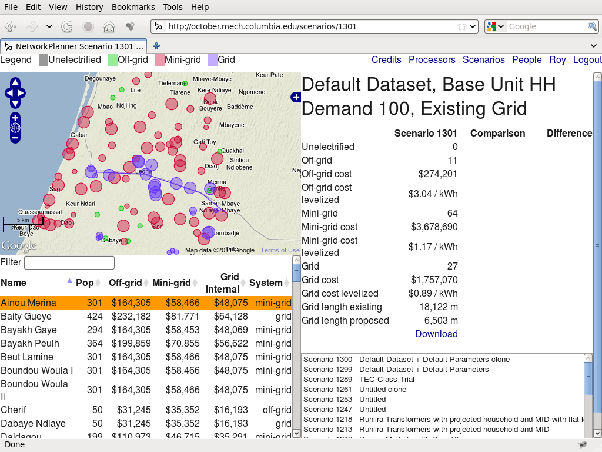
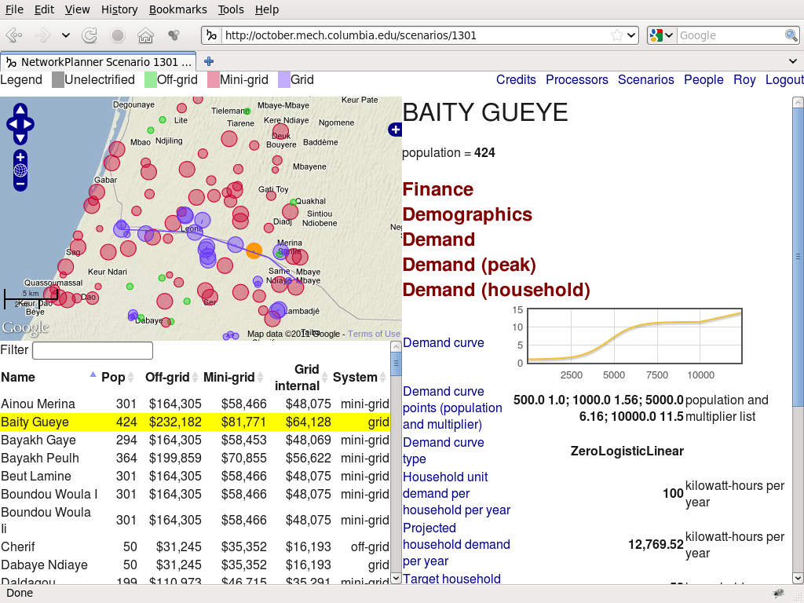

Reference
=========

Here is a list of common actions.

Create an account
-----------------

1. `Open the web interface <http://october.mech.columbia.edu>`_.
2. Click `Register for an account <http://october.mech.columbia.edu/people/register>`_ at the top of the `Login <http://october.mech.columbia.edu/people/login>`_ page.

Browse old scenarios
--------------------

1. `Login <http://october.mech.columbia.edu/people/login>`_.
2. Click `Scenarios <http://october.mech.columbia.edu>`_ at the upper right of the page.
3. Pick a scenario you want to see and click View.

Create a new scenario
---------------------

1. Click `Create a new scenario <http://october.mech.columbia.edu/scenarios/new>`_ at the top of the `Scenarios <http://october.mech.columbia.edu>`_ page.
2. (Required) Upload a CSV of unelectrified locations and their populations.
3. (Optional) Upload a ZIP containing a shapefile of existing high and medium voltage line.
4. Click Add this scenario to the queue.

For more details, please see :ref:`scenario-input`.

Modify an old scenario with different parameters or datasets
------------------------------------------------------------

1. Pick a scenario you want to modify and click Clone.
2. Click on sections to see parameters.
3. Click on parameter names to see underlying code.
4. Modify parameters or override uploaded datasets.
5. Click Add this scenario to the queue.

Override computer projections with community-specific data
----------------------------------------------------------

1. `Open the CSV of unelectrified locations and their populations as a spreadsheet <http://october.mech.columbia.edu/files/demographicsLL.csv>`_.
2. `Open the table of model variables <http://october.mech.columbia.edu/docs/metric-mvMax3.html>`_.
3. Pick the variables that you want to override and find their long or short aliases from the table.
4. Append the aliases as column headers in your spreadsheet.
5. Add your community-specific data under the appropriate row and column; leave blanks where you want to use the computer's estimates.
6. Click Add this scenario to the queue.

============= ============= ============== ========== ======================================== =========
Name          Latitude      Longitude      Population demand > projected nodal demand per year og_dg_dcp
============= ============= ============== ========== ======================================== =========
Ndoune        15.693        -16.434        301        50000
Toby          15.680        -16.378         57                                                 3
Merina Dakhar 15.633        -16.432         52        2000                                     4
============= ============= ============== ========== ======================================== =========

.. _scenario-input:

Create a new scenario from scratch
----------------------------------

Click `Create a new scenario <http://october.mech.columbia.edu/scenarios/new>`_ at the top of the `Scenarios <http://october.mech.columbia.edu>`_ page.

- Select a metric model, e.g. mvMax3.
- Select a network model, e.g. modKruskal.
- Click on sections to see parameters.
- Click on parameter names to see underlying code.
- Give a descriptive scenario name.
- Set the scenario scope to be private or public.

.. image:: images/NPScenarioAdd.png
    :scale: 80%

Upload a custom demographic dataset
-----------------------------------

Make sure your demographic dataset is in ``.csv`` format.  Include community names, their locations and populations.

- If your location coordinates are in latitude and longitude, please use the template `demographicsLL.csv <http://october.mech.columbia.edu/files/demographicsLL.csv>`_.
- If your location coordinates are in a UTM projection, please use the template `demographicsXY.csv <http://october.mech.columbia.edu/files/demographicsXY.csv>`_ and replace the PROJ.4 spatial reference string.  You can find the PROJ.4 string corresponding to a shapefile using `qGIS <http://www.qgis.org>`_.

.. warning::

    Specify populations as positive whole numbers.

Change model parameters
-----------------------

Parameters are organized into sections.  Click on section names to expand or collapse them.  In the mvMax3 metric model, the following sections are visible:

- Finance
- Demographics
- Demand (peak)
- Demand (household)
- Demand (productive)
- Demand (social infrastructure)
- Distribution
- System (off-grid)
- System (mini-grid)
- System (grid)

For example, expand the section *Demand (household)* and set *Household unit demand per household per year* to 100.  Click on *Household unit demand per household per year* to see how it is computed.  

.. note::

    Household unit demand is the average electricity consumption in kilowatt-hours per year of a single household in a community with a population corresponding to the scaling factor of one.  Thus, if your household demand curve points are ``500 1; 1000 1.56; 5000 6.16; 10000 11.5``, then household unit demand is the average electricity consumption of a single household in a community with a population of 500.

.. warning::

    Do not include commas in parameter values.

Run the scenario
----------------

When you have finished changing model parameters, click Add this scenario to the queue.

.. note::

    While you are waiting for a processor to run the scenario, you can submit another one.  Click `Scenarios <http://october.mech.columbia.edu>`_ at the upper right of the page and create a new scenario.

View results
------------

.. image:: images/NPScenarioMap.png

When the scenario has finished computing, a map will appear with results.

- The radius of each circle corresponds to the size of the community's population.
- The color of each circle corresponds to the recommended electricity technology.  The color legend is at the top of the page.
- Solid lines represent existing grid line if you uploaded a `ZIP containing a shapefile of existing networks <http://october.mech.columbia.edu/files/networksXY.zip>`_.
- Dashed lines represent proposed grid extension.  If you did not upload existing grid locations, then the dashed lines join grid-compatible communities.

The scenario table at the right lists how many communities are recommended for which electricity technology, how much it will cost and how much a utility should charge per kilowatt-hour to recover its capital and recurring expenses over the time horizon.

- Click the scenario name to rename the scenario or change its scope.
- Drag the mouse on the map to move around.
- Scroll the mouse wheel on the map to zoom in or out.
- Click on a community in the map or community table at the bottom to see its demand and cost projections.
- Click on section names to expand and collapse them.
- Click on a blank area in the map to return to the scenario table.
- Click on a scenario name in the list on the bottom right to compare results.
- Type in the input box next to Filter to filter the table.

