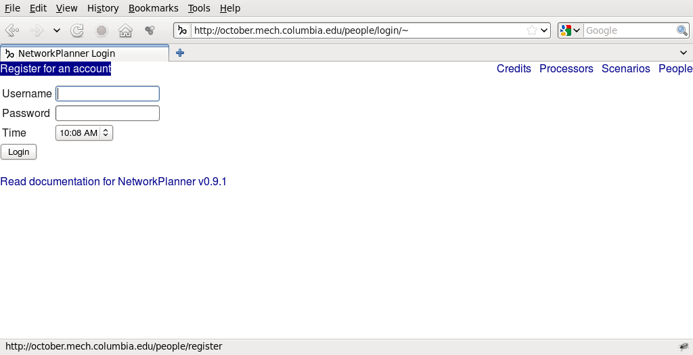
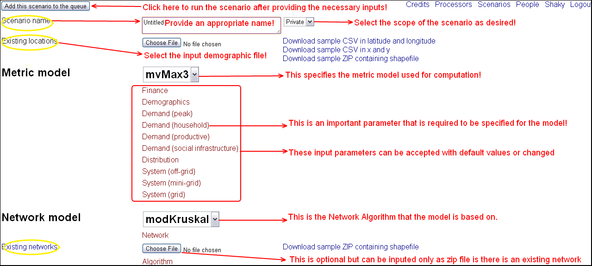
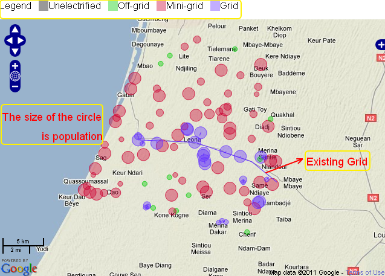

Tutorial
========

Overview
--------

Create an account
^^^^^^^^^^^^^^^^^

1. `Open the web interface <http://october.mech.columbia.edu>`_
2. `Login > Register for an account <http://october.mech.columbia.edu/people/register>`_

Browse old scenarios
^^^^^^^^^^^^^^^^^^^^

1. `Login <http://october.mech.columbia.edu/people/login/%7Escenarios%7E1289.html>`_
2. `Click Scenarios to browse old scenarios <http://october.mech.columbia.edu>`_
3. Pick a scenario you want to see and click View

Create new scenario
^^^^^^^^^^^^^^^^^^^

1. `Scenarios > Create a new scenario <http://october.mech.columbia.edu/scenarios/new>`_
2. (Required) Upload a CSV of unelectrified locations and their populations
3. (Optional) Upload a ZIP containing a shapefile of existing high and medium voltage line
4. Click Add this scenario to the queue

For more details, please see :ref:`create-new-scenario`

Modify an old scenario with different parameters or datasets
^^^^^^^^^^^^^^^^^^^^^^^^^^^^^^^^^^^^^^^^^^^^^^^^^^^^^^^^^^^^

1. Pick a scenario you want to modify and click Clone
2. Click on sections to see parameters
3. Click on parameter names to see underlying code
4. Modify parameters or override uploaded datasets
5. Click Add this scenario to the queue

Override computer projections with community-specific data
^^^^^^^^^^^^^^^^^^^^^^^^^^^^^^^^^^^^^^^^^^^^^^^^^^^^^^^^^^

1. `Open the CSV of unelectrified locations and their populations as a spreadsheet <http://october.mech.columbia.edu/files/demographicsLL.csv>`_
2. `Open the table of model variables <http://october.mech.columbia.edu/docs/metric-mvMax3.html>`_
3. Pick the variables that you want to override and find their long or short aliases from the table
4. Append the aliases as column headers in your spreadsheet
5. Add your community-specific data under the appropriate row and column; leave blanks where you want to use the computer's estimates
6. Click Add this scenario to the queue

============= ============= ============== ========== ============================================================================== =========
Name          Latitude      Longitude      Population demand (social infrastructure) > projected commercial facility demand per year og_dg_dcp
============= ============= ============== ========== ============================================================================== =========
Ndoune        15.6925578733 -16.4335391924        301 20000
Toby          15.6797592961 -16.3779858770         57                                                                                3
Merina Dakhar 15.6326203817 -16.4324284790         52 6000                                                                           4
============= ============= ============== ========== ============================================================================== =========

Input
-----

.. _create-new-scenario:

Create a new scenario from scratch
^^^^^^^^^^^^^^^^^^^^^^^^^^^^^^^^^^

Click `Create a new scenario <http://october.mech.columbia.edu/scenarios/new>`_ at the top of the `Scenarios <http://october.mech.columbia.edu>`_ page.

- Select a metric model, e.g. mvMax3
- Select a network model, e.g. modKruskal
- Click on sections to see parameters
- Click on parameter names to see underlying code
- Give a descriptive scenario name
- Set the scenario scope to be private or public

Select the demographic data file to be uploaded for the scenario
^^^^^^^^^^^^^^^^^^^^^^^^^^^^^^^^^^^^^^^^^^^^^^^^^^^^^^^^^^^^^^^^

.. note::

    *The input file to be uploaded should be in .csv format, and should include the projection system, the location names, X/Y coordinates (for UTM projection) or latitudes/longitudes, and population valuesfor locations.The input file can also be a shapefile in a zipped file format.*

*   Click the \ "**Choose File**"\ option next to the label for Existing Locations to select your input file
*   Navigate to the demographics.csv file and click open. (This selects the file, but does not yet upload it)
*   You can download a sample input file by clicking here
        
.. warning::

        The population/pop field must be an integer or a whole number!

To change the metric parameters
^^^^^^^^^^^^^^^^^^^^^^^^^^^^^^^

*   Most parameters (settings controlling costs and technical details) are accessible (and changeable) by clicking through the linked text listed below  \ "**Metric Model**"\  or  \ "**Network Model**"\ , and searching through the nested linked text. 

    *   Example:To change the household level demand  setting:  Click through  \ "**Demand(Household)**"\ > Locate \ "**Household unit demand per household per year**"\ > and type the desired value into the window.

.. warning::

        The parameter values must be entered without commas!

Output
------

To execute the scenario:
^^^^^^^^^^^^^^^^^^^^^^^^^^^^^

*	Click the button- `Add this scenario to queue`_.

.. _Add this scenario to queue: http://october.mech.columbia.edu/scenarios/new

.. note::
    This uploads the selected input files and all the parameters, then runs the model and outputs a map and data results. The view shifts to the map/data view.  It may take about a minute for the scenario run to finish. Several runs can be initiated simultaneously. 

 
*   While one scenario run is underway, click on the \ "**Scenarios**"\ link in the upper-right of the map/data view, and begin another.
*   The scenarios list page displays contains the following information:

    *   The date and time of when a scenario was \ "**Created**"\.
    *   The \ "Status"\ of the scenario whether it was successfully run- \ "**Done**"\ or failure to run as-\ "**Failed**"\. 
    *   The \ "**Scope**"\ of the scenario as to whether it can only be viewed by you-\ "**Private**"\ or can be viewed by everyone-\ "**Public**"\.
    *   You can view a previously run scenario by clicking on \ "**View**"\.
    *   You can download the scenario outputs by clicking on \ "**Download**"\. 

        *   (This provides both metric outputs in csv files and GIS Shapefiles in zip format).
    *	You can also duplicate a scenario by clicking on the \ "**Clone**"\ option. 

        *   (This is handy when you are using the same demographics data file and want to rerun a scenario)

    *	You can also override the cloned dataset by clicking \ "**Override**"\ which will allow us to enter a whole new set of dataset.
    *	You can also delete a scenario by clicking on the \ "**Delete**"\ option.
  

To view the output results
^^^^^^^^^^^^^^^^^^^^^^^^^^

rename scope

*   The scenario output is displayed by default as a map with tabular results.
*   The map/ data view displays the results of the scenario run using the following symbology:
  
    *	The radius of the circle indicates the population size of the nodes(communities).
    *   The color of the circle (Grey=Unelectrified Green=Off-grid, Pink=Mini-grid and Purple=Grid) represents the model recommended (least-cost) technology option for that point(which is not necessarily the actual technology in place). 
    *   The lines between circles indicate the cost-effective proposed grid network links(again, not necessarily the actual grid in place).
    *   When you hover over the network line, a pop up box will appear that shows the model proposed medium voltage grid length.
